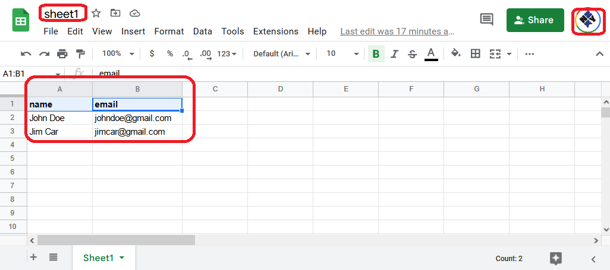

<h2>Motivation</h2>
Play with google sheets api using node and service account

<h2>Setup</h2>
<ol>
<li>Create a <a href='https://developers.google.com/workspace/guides/create-project'>google cloud project</a> to use Google Workspace APIs  e.g. google sheets project name "Google Sheets API Sample"</li>
<li>Enable API for "Google Sheets API Sample" project</li>
<li>Create credential - service account</li>
<li>Export the service credential file - here it is on secret directory but git ignored</li>
<li>Share the resource - google sheet file with client_email (check secret)</li>
<li>Use the credential file (must be on .gitignore)  inside your application which access google workspace API e.g. google sheet API</li>
</ol>

<h2>Sheet</h2>

<h2>Why am i using here next.js</h2>
This might well be just server stuff so why use next.js ?
<ul>
<li>typescript out of the box</li>
<li>support env variable out of the box</li>
<li>deployment out of the box by button click</li>
<li>it is easy to use UI to access different operations : read / add / delete / update</li>
</ul>

<h2>Open issues</h2>
<ul>
<li>each column on 'google-sheets-api-playground' tab has title : name and email. This is used in the code to access specific column. Is it a must ?</li>
</ul>